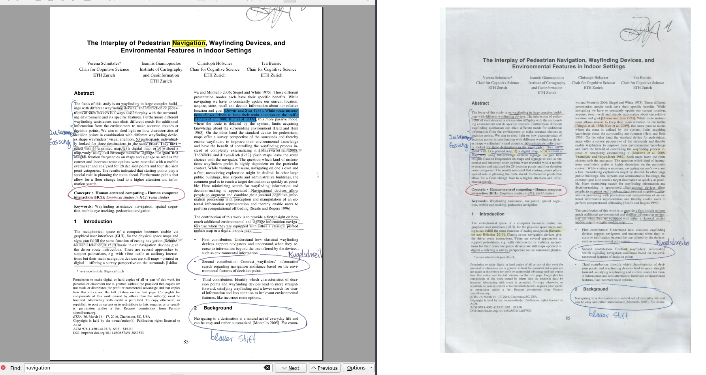

# ir-annotation-extraction

Extracts annotations from a document scanned under infrared light and inserts those annotations into the original PDF.

Very work in Progress.

  

# Usage

`python3 insert_annotation.py navigation_1.pdf transparent_navigation.png navigation_ir.jpg bias.png`

# Notes

## Timings (in seconds)

 * read images: 0.4200859069824219
 * bounding boxes: 0.10314464569091797
 * homography: 0.0001049041748046875
 * warp: 0.03565788269042969
 * write image: 0.12440276145935059
 * insert annotation: 3.0618648529052734

## Discoveries

 * highlighter annotations can be extracted rather robustly by using HSV color space, only keeping highly saturated areas, and dilating the resulting mask
   * this could lead to false positives with color prints
 * pen annotations such as notes or underlines can be extracted by thresholding IR and RGB image and performing an XOR operation

## Ideas

 * stack color channels of IR scan for 3x resolution? Problem: we do not know the order (and it might be arbitrary)

# References

Test image taken from the paper *[The interplay of pedestrian navigation, wayfinding devices, and environmental features in indoor settings](https://dl.acm.org/doi/abs/10.1145/2857491.2857533)*.

Verena Schnitzler, Ioannis Giannopoulos, Christoph Hölscher, and Iva Barisic. 2016. The interplay of pedestrian navigation, wayfinding devices, and environmental features in indoor settings. In Proceedings of the Ninth Biennial ACM Symposium on Eye Tracking Research & Applications (ETRA '16). Association for Computing Machinery, New York, NY, USA, 85–93. DOI:https://doi.org/10.1145/2857491.2857533
